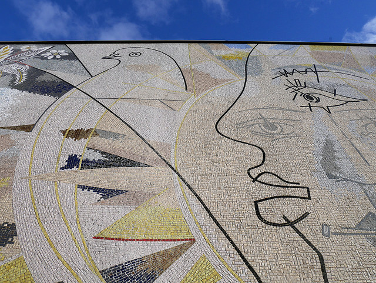

Die Auswahl des Cover-Motivs für die Ausgabe 30 lässt sich sowohl
inhaltlich als auch biografisch und sogar zeitgeschichtlich begründen.
Die Grundlage bildet eine Fotografie eines Mosaikwandbildes des
Künstlers Walter Womacka, das seit 1988 die südwestliche Außenwand einer
Gaststätte auf der Marzahner Promenade in Berlin-Marzahn einnimmt.

Das Wandbild trägt den Titel *Frieden* und ist leider furchtbar aktuell
angesichts der erschreckenden Eskalation des Krieges in Syrien, dem man
in der globalen Perspektive erschreckend hilflos gegenüberzustehen
verpflichtet ist - ein Gefühl, das dieser Tweet 
<https://twitter.com/sshaked/status/809112310119800833> 
des Bibliothekswissenschaftlers Shaked Spear deprimierend präzise fasst
- und auf einer lokalen Ebene immerhin mit der Bereitschaft zur Aufnahme
von Flüchtlingen einhergehen kann und aus unserer Sicht auch muss. In
diesem Zusammenhang sei noch einmal auf die hevorragende Institution der
Asylotheken verwiesen: <http://www.asylothek.de/>.

Die Bildsprache ist auch im gewählten Ausschnitt Womacka-typisch
eingängig. Friedenstaube und Mensch erscheinen als schlichte Zeichnung.
Sie wirken fast einen Hauch zu geometrisiert. Hinter dem Profil deutet
sich als Unterlagerung ein Porträt an. In diesem Ausschnitt wirkt es wie
ein Aufruf, zwischen den Zeilen zu lesen, genau hinzuschauen, wie eine
Erinnerung also daran, dass sich hinter dem vordergründig und
unmittelbar Wirkenden Variationen und andere Perspektiven befinden. Der
sinnliche Fokus - Auge und Mund - liegt auf dem Sehen und Sprechen.
Überraschenderweise fehlt auch in der Gesamtsicht das Ohr, als wäre das
Zuhören in der späten DDR ohne Belang. Wenn Sprache wahrgenommen wird,
dann wird sie von den Lippen gelesen.

Die grafische Qualität erinnert an technische Entwürfe, was die
Verbindung zu unserem Thema der digital geprägten Geisteswissenschaften
herstellt, zumal das Mosaiksteinchen heute unweigerlich die Idee des
Pixels hervorruft. Mensch und Gesellschaftskonzepte wie die des Friedens
werden gerastert dargestellt, hier allerdings nicht in der
digitaltechnischen Perfektion, sondern von Hand gesetzt und dennoch in
größtmöglicher Exaktheit. Die Bildpunkte erkennt man freilich erst aus
der Nahsicht. Aus der Ferne zeigt sich eine Art der eingängigen
Alltagsillustration, wie sie für den Städtebau der DDR typisch war und
der neuen Fußgängerzone im neuen Wohngebiet der vor ihrem Ende stehenden
Deutschen Demokratischen Republik einen Symbolreigen des sozialistischen
Narrativs vermitteln sollte. Picassos Friedenstaube trifft die
Ingenieure des Menschlichen - das ist die Bildsprache nicht nur dieser
Marzahner Promenadenmischung.

Wenigstens ein Teil der Redaktion trägt Spurenelemente dieser
Gesellschaftskultur im Bestand der Erinnerung, da er sie noch in
Schuljahren und teils sogar in exakt dieser Nachbarschaft kennengelernt
hat. Es war eine Welt der einfachen Wahrheiten und wenn man sie zu
akzeptieren bereit war, konnte man sich mehr oder weniger angenehm in
ihr einrichten. Wenn man heute durch Marzahn wandert, spürt man sicher
noch deutlicher als damals die sehr ambitionierte städtebauliche
Grundanlage, die dem urbanen Durcheinander der Innenstadtbezirke eine
trotz aller Monumentalität geradezu sanfte und in jedem Fall
überschaubare Lebensmodellierung entgegensetzte. Das Wunschbild des
Einfamilienhauses findet sich hier neben dem 22-Geschosser in einer Art
überdimensionaler Parklandschaft verwirklicht. Mit dem zeitlichen
Abstand versteht man zugleich, dass die Bürgerlichkeit, die sich hier
offenbart, die des kleinen Maßes war. Normierte Wohnzellen treffen auf
Schrebergartenidyllen, die heute wie gestern das Ideal des mit dem
Lineal gezogenen Beetes ausstrahlen. Marzahn ist eine raumgewordene Idee
der freundlichen Kontrolle und damit auf seine Art Sinnbild der DDR. An
den Rändern, die hier in der Mitte liegen, brach und bricht es notwendig
auf. Der Stadtumbau hat auch die Marzahner Promenade verändert. Die Ende
der 1980er von den Anwohnern herbeigesehnten Ladengeschäfte tragen sich
kaum, unter anderem da die Nachwendezeit eine der üblichen und farblosen
Shopping-Malls an das Ende der Nahversorgungszone setzte. Aber tot ist
der Raum nicht. Dazu ballen sich hier zu viele Menschen. An Wochentagen
ist Markt unter dem überlebensgroßen Bronzedenkmal für die Erbauer des
Bezirks und die vietnamesischen Zigarettenhändler stehen nach wie vor am
Eck als wäre es noch 1993 und zaubern auf Zuruf ein steuerfreies
Päckchen oder eine Stange hervor. Wer will, kann gleich in der Nähe mit
der Tram direkt ins Herz des neuen Berlins fahren. Zeitschichten
überlagern und durchdringen sich in einer Form, die man durchaus als
postmodern bezeichnen kann. In der Nebenspur der Promenade gibt es sogar
noch etwas vergessene Pop-Art von Hans Ticha. Den dem
Eastgate-Einkaufszentrum entgegengesetzten Endpunkt der Promenade bildet
schließlich das Freizeitzentrum Marzahn mit einem gut besuchten
öffentlichen Schwimmbad von dessen Fensterfront aus man Ingeborg
Hunzingers disharmonisches “Denkmal für Kommunisten und
antifaschistische Widerstandskämpfer” sehen kann. Und hinter diesem
leuchtet in blauen Großbuchstaben in diesen Stadtraum aus einer anderen
(prädigitalen) und zugleich aus unserer (postdigitalen) Zeit:
BIBLIOTHEK.

